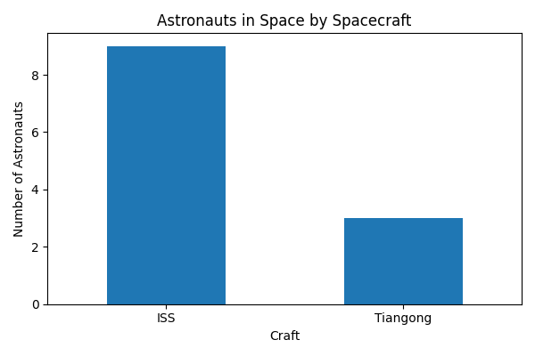

# Visualizing API Data in Python: A Beginner's Guide

Have you ever wanted to analyze live data? The way many organizations share their data is through Application Programming Interfaces, more commonly known as APIs. Visualizing API data helps us see trends and patterns in real time, instead of digging through raw text or tables.

In this tutorial, we will step into the world of APIs by fetching real data from a public API, turning it into a tidy table with ```Pandas```, and creating a simple chart with Matplotlib. 

More specifically, we are going to use the [Open Notify API](http://api.open-notify.org/astros.json) to:
* Fetch live JSON data about astronauts currently in space.
* Convert it into a ```Pandas``` DataFrame.
* Create a simple visualization of astronauts by spacecraft.
This is a short, hands-on exercise you can adapt to almost any API.

## Pre-reqs

We will be doing all the work for this tutorial in Python. To set up, you will need to install and import a few libraries. 

First, open your terminal and make sure you have these installed:

```pip install requests pandas matplotlib```

In Python, import the libraries needed for the tutorial. We’ll use ```requests``` to call the API, ```pandas``` for data wrangling, and ```matplotlib``` for plotting.

```
import requests
import pandas as pd
import matplotlib.pyplot as plt
import numpy as np
```

## Fetching The Data

Now we will access the actual API to fetch astronaut data. This API returns JSON with three keys: ```"people"```,```"number"```, and ```"message"```.

```
url = "http://api.open-notify.org/astros.json"
response = requests.get(url, timeout=10)
data = response.json()

print(data.keys())
print(data["number"], "people are in space right now.")
```

An example of how your output should look is the following:
```
dict_keys(['people', 'number', 'message'])
10 people are in space right now.
```

## Loading in The Data

Now that we have the data from the API, we will be converting it to a ```Pandas``` DataFrame. 
In our example, the ```"people"``` key contains a list of dictionaries. This works perfectly for a ```Pandas``` DataFrame.

```
astronauts = pd.DataFrame(data["people"])
print(astronauts.head())
```

Your output should look something like this:
```
           craft              name
0             ISS   Sergey Prokopyev
1             ISS     Dmitry Petelin
2             ISS     Frank Rubio
```

## Visualizing The Data

Now that we have the data saved as a DataFrame, we will be using it to make a basic chart. 

For our example, let's group by the ```"craft"``` column and plot the counts.
```
# Count astronauts by spacecraft
craft_counts = astronauts["craft"].value_counts().reset_index()
craft_counts.columns = ["Craft", "Astronauts"]
```

Now that we have our counts, lets plot the data. The data we are working with looks like this:

| Craft    | Astronauts |
|----------|------------|
| ISS      | 9          |
| Tiangong | 3          |

Because we’re comparing counts across spacecraft, a bar chart makes it easy to see which craft currently host the most astronauts.

```
# Plot
ax = craft_counts.plot(kind="bar", x="Craft", y="Astronauts", legend=False, figsize=(6,4))
ax.set_title("Astronauts in Space by Spacecraft")
ax.set_ylabel("Number of Astronauts")
plt.xticks(rotation=0)
plt.tight_layout()
plt.show()
```
Your plot should look something like this:



## Now What?

Now you are ready to try accessing public API's on your own! Test you skills and see if you can visualize API data. 

Pick one API from the list below and try to repeat the same workflow: fetch the data, load it into a DataFrame, and build a simple chart. Even a tiny change will give you practice adapting to different data formats:
* Pokemon API ```https://pokeapi.co/api/v2/pokemon?limit=10```
* Exchange Rates API ```https://api.exchangerate.host/latest?base=USD```
* Covid 19 API ```https://api.covid19api.com/summary```